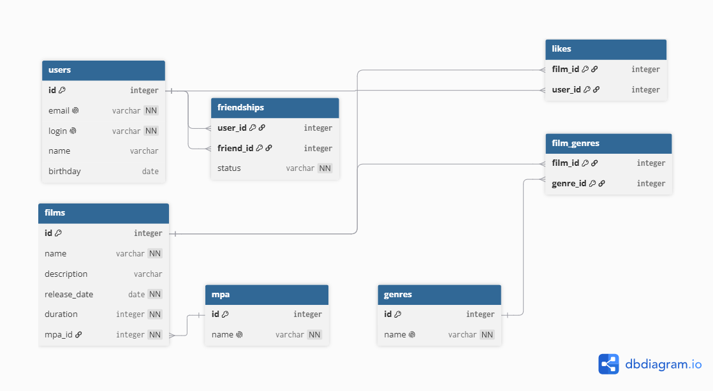

# java-filmorate
Template repository for Filmorate project.

## Схема базы данных



### Примеры SQL-запросов для основных операций

#### 1. Получить список фильмов с рейтингом MPA
```sql
SELECT 
    f.id, 
    f.name, 
    f.description, 
    f.release_date, 
    f.duration
FROM films f
JOIN mpa m ON f.mpa_id = m.id
GROUP BY f.id, f.name, f.description, f.release_date, f.duration;
```
#### 2. Получить топ-10 популярных фильмов по количеству лайков
```sql
SELECT 
    f.id, 
    f.name, 
    COUNT(l.user_id) AS likes_count
FROM films f
LEFT JOIN likes l ON f.id = l.film_id
GROUP BY f.id, f.name
ORDER BY likes_count DESC, f.id ASC
LIMIT 10;
```
#### 3. Получить список друзей двух пользователей
```sql
SELECT 
    u.id, 
    u.name, 
    u.login, 
    u.email
FROM users u
JOIN friendships f1 ON u.id = f1.friend_id
JOIN friendships f2 ON u.id = f2.friend_id
WHERE f1.user_id = 1 
  AND f2.user_id = 2 
  AND f1.status = 'CONFIRMED' 
  AND f2.status = 'CONFIRMED';
```